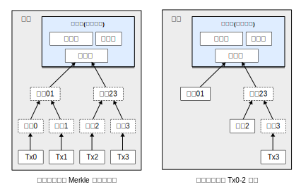
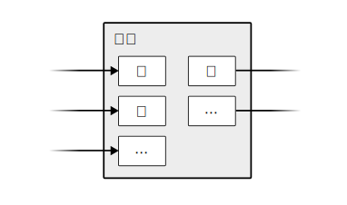

# 比特币：一种点对点的电子现金系统

​								作者：中本聪
​								satoshin@gmx.com
​								www.bitcoin.org 
​								2008.10.31


> **Abstract.** A purely peer-to-peer version of electronic cash would allow online payments to be sent directly from one party to another without going through a financial institution. Digital signatures provide part of the solution, but the main benefits are lost if a trusted third party is still required to prevent double-spending. We propose a solution to the double-spending problem using a peer-to-peer network. The network timestamps transactions by hashing them into an ongoing chain of hash-based proof-of-work, forming a record that cannot be changed without redoing the proof-of-work. The longest chain not only serves as proof of the sequence of events witnessed, but proof that it came from the largest pool of CPU power. As long as a majority of CPU power is controlled by nodes that are not cooperating to attack the network, they'll generate the longest chain and outpace attackers. The network itself requires minimal structure. Messages are broadcast on a best effort basis, and nodes can leave and rejoin the network at will, accepting the longest proof-of-work chain as proof of what happened while they were gone. 
>
> **概要**：一个纯粹的点对点的电子现金系统，让任何人都能直接在线支付，无需金融机构。数字签名能解决部分问题，但，如果还要靠信任第三方来防止“一币多花”，电子支付的主要优势就被没了。我们提出，用点对点网络解决双重支付问题：该网络给每笔交易标记时间戳，方法是：把交易哈希值打包记录到一条不断延展的、以散列为基础的工作证明链上，谁想篡改记录就得重做所有计算。最长的链，既用于证明所见证事件的顺序，也证明它来自最大的 CPU 算力池。只要大多数算力掌握在诚实节点手里（不与那些尝试攻击网络的节点合作），这些节点将会生成最长链，攻击者追不上。网络本身需要最简单的结构。消息尽力而为地广播，而节点随时可加入或离开，同时，接受最长的工作证明链作为他们离开期间所发生事件的证明。

-----


## 1. 简介 (Introduction)


Commerce on the Internet has come to rely almost exclusively on financial institutions serving as trusted third parties to process electronic payments. While the system works well enough for most transactions, it still suffers from the inherent weaknesses of the trust based model. Completely non-reversible transactions are not really possible, since financial institutions cannot avoid mediating disputes. The cost of mediation increases transaction costs, limiting the minimum practical transaction size and cutting off the possibility for small casual transactions, and there is a broader cost in the loss of ability to make non-reversible payments for non-reversible services. With the possibility of reversal, the need for trust spreads. Merchants must be wary of their customers, hassling them for more information than they would otherwise need. A certain percentage of fraud is accepted as unavoidable. These costs and payment uncertainties can be avoided in person by using physical currency, but no mechanism exists to make payments over a communications channel without a trusted party.


当今的互联网商业，几乎都靠金融机构作为可信第三方来处理电子支付。这套系统在多数情况下行之有效，但其基于信任的模式存在固有缺陷。比如：交易无法彻底不可逆，因为金融机构必须调解争议。调解成本会让交易成本变高，限制最小交易规模，且干脆阻断小额支付的可能性。此外，更大的成本是：我们无法为不可逆的服务提供不可逆的支付。逆转的可能性，导致了对信任的需求无处不在。商家必须提防顾客，麻烦他们提供本不必要的更多信息。一定的欺诈也被认为是难以避免。这些成本和支付不确定性，虽然在面对面交易中可通过使用实体货币避免；但在网络上，我们却没有一种机制能在不依赖第三方的情况下进行支付。


What is needed is an electronic payment system based on cryptographic proof instead of trust, allowing any two willing parties to transact directly with each other without the need for a trusted third party. Transactions that are computationally impractical to reverse would protect sellers from fraud, and routine escrow mechanisms could easily be implemented to protect buyers. In this paper, we propose a solution to the double-spending problem using a peer-to-peer distributed timestamp server to generate computational proof of the chronological order of transactions. The system is secure as long as honest nodes collectively control more CPU power than any cooperating group of attacker nodes.


我们真正需要的，是一个基于加密证明、而非基于信任的电子支付系统，允许任意两方直接交易，无需可信第三方。通过让交易在计算上难以撤销来保护卖家免受欺诈，同时通过常规的托管机制来保护买家。本文中，我们提出一个针对双重支付问题的方案：利用一个点对点的、分布式的时间戳服务器，为交易的时间顺序生成计算证明。只要诚实节点总体上控制的 CPU 算力超过任何协同攻击者节点，该系统就是安全的。


## 2. 交易 (Transactions)


We define an electronic coin as a chain of digital signatures. Each owner transfers the coin to the next by digitally signing a hash of the previous transaction and the public key of the next owner and adding these to the end of the coin. A payee can verify the signatures to verify the chain of ownership.


我们把一枚电子硬币定义为一个数字签名链。每个所有者转交币时，要通过在这个链的末尾添加以下的数字签名：前一笔交易的哈希值（hash，音译，亦翻译为“散列值”）和下一个持有者的公钥。收款人可以通过验证签名来验证数字签名链的归属。


The problem of course is the payee can't verify that one of the owners did not double-spend the coin. A common solution is to introduce a trusted central authority, or mint, that checks every transaction for double spending. After each transaction, the coin must be returned to the mint to issue a new coin, and only coins issued directly from the mint are trusted not to be double-spent. The problem with this solution is that the fate of the entire money system depends on the company running the mint, with every transaction having to go through them, just like a bank.


问题在于，收款人无法验证之前的所有者中，有没有人“一币多花”。常见做法是引入一个可信的中心化机构，或"铸币厂"，由它检查每一笔交易是否重复。每次交易后，硬币必须回到铸币厂重新发行。进而，只有铸币厂直接发行的硬币才是可信的、未被双重支付过的。但这样一来，整个货币系统的命运取决于运营铸币厂的公司，每笔交易都必须经过它们，就像银行一样。


We need a way for the payee to know that the previous owners did not sign any earlier transactions. For our purposes, the earliest transaction is the one that counts, so we don't care about later attempts to double-spend. The only way to confirm the absence of a transaction is to be aware of all transactions. In the mint based model, the mint was aware of all transactions and decided which arrived first. To accomplish this without a trusted party, transactions must be publicly announced[^1], and we need a system for participants to agree on a single history of the order in which they were received. The payee needs proof that at the time of each transaction, the majority of nodes agreed it was the first received.


我们需要一种方法，能让收款人确认之前的所有者没有在任何更早的交易上签过名。对我们来说，最早的那笔交易才算数，所以，我们不在乎后续的双重支付尝试。要确认一笔交易不存在，唯一办法是获悉所有的交易。在铸币厂模式下，铸币厂已然知悉所有的交易，并能决定他们的顺序。为了在没有可信第三方的情况下做到这一点，交易必须被公开宣布[^1]。进而，我们需要一个系统，能让参与者们一致认同他们接收到的唯一交易历史。收款人需要证明，在每笔交易发生时，大多数节点都认同它是第一个收到的。


## 3. 时间戳服务器 (Timestamp Server)


The solution we propose begins with a timestamp server. A timestamp server works by taking a hash of a block of items to be timestamped and widely publishing the hash, such as in a newspaper or Usenet post[^2] [^3] [^4] [^5]. The timestamp proves that the data must have existed at the time, obviously, in order to get into the hash. Each timestamp includes the previous timestamp in its hash, forming a chain, with each additional timestamp reinforcing the ones before it.


我们的解决方案从一种“时间戳服务器”开始。它的做法是：为一组（block）记录（items）的哈希打上时间戳，然后把哈希广播出去，就像登在报纸上或发到新闻组（Usenet）的帖子上[^2] [^3] [^4] [^5]。显然，时间戳能证明这些数据在那个时间点之前就存在，否则也无法生成哈希。每个时间戳在其哈希中都包含之前的时间戳，因此形成了一条链；而每个新增的时间戳不断加固之前的记录。


## 4. 工作证明 (Proof-of-Work)


To implement a distributed timestamp server on a peer-to-peer basis, we will need to use a proof-of-work system similar to Adam Back's Hashcash[^6], rather than newspaper or Usenet posts. The proof-of-work involves scanning for a value that when hashed, such as with SHA-256, the hash begins with a number of zero bits. The average work required is exponential in the number of zero bits required and can be verified by executing a single hash.


为了实现一个基于点对点的分布式时间戳服务器，我们需要使用类似 Adam Back 提出的哈希现金[^6]的工作证明系统，而不是像报纸或新闻组帖子那样。所谓的工作证明，就是搜索一个数，使得被哈希时，让得到的值（比如用 SHA-256 计算）以一定数量的零开头。随着所需零的数量的增加，所需的平均工作量会呈指数级增长，并且，这个工作量的验证只需通过算一次哈希。


For our timestamp network, we implement the proof-of-work by incrementing a nonce in the block until a value is found that gives the block's hash the required zero bits. Once the CPU effort has been expended to make it satisfy the proof-of-work, the block cannot be changed without redoing the work. As later blocks are chained after it, the work to change the block would include redoing all the blocks after it.


在时间戳网络中，我们是这样实现工作证明的：在区块中不断增加一个随机数（Nonce），直至找到使这个区块的哈希值以特定数量的 0 开头的数值。一旦所投入的 CPU 算力，使其满足了工作量证明，那么这个区块就无法再被改动，除非重做所有计算。
随着后续区块一层层被链接上，想改动这个区块，就得重做它之后所有区块的工作。


The proof-of-work also solves the problem of determining representation in majority decision making. If the majority were based on one-IP-address-one-vote, it could be subverted by anyone able to allocate many IPs. Proof-of-work is essentially one-CPU-one-vote. The majority decision is represented by the longest chain, which has the greatest proof-of-work effort invested in it. If a majority of CPU power is controlled by honest nodes, the honest chain will grow the fastest and outpace any competing chains. To modify a past block, an attacker would have to redo the proof-of-work of the block and all blocks after it and then catch up with and surpass the work of the honest nodes. We will show later that the probability of a slower attacker catching up diminishes exponentially as subsequent blocks are added.


工作量证明，也解决了集体决策中的“代表权”问题，也就是“如何决定谁能代表大多数来做决定”。如果我们用“一个 IP 地址一票”的方式来决定谁是“大多数”，那么任何能控制大量 IP 的人都能操控结果。而工作量证明，本质是“一个 CPU 一票”。在这里，“大多数”的决定，就体现在投入了最多算力、因此也最长的那条链上。只要多数算力掌握在诚实节点手中，诚实链就增长得最快，速度上会远超任何竞争链。想要修改历史区块，攻击者就必须重做该区块以及其后所有区块的全部工作量证明，然后还要追上并反超诚实链的总工作量。我们稍后会证明：随着后续区块的增加，一个算力更落后的攻击者能追上的概率，会呈指数级下降。


To compensate for increasing hardware speed and varying interest in running nodes over time, the proof-of-work difficulty is determined by a moving average targeting an average number of blocks per hour. If they're generated too fast, the difficulty increases.


为了应对硬件算力的提升，以及随着时间推移可能产生的节点数量的变化，工作证明的难度会根据每小时平均区块数的移动平均值来决定。如果区块生成过快，难度就会提高。


## 5. 网络 (Network)


The steps to run the network are as follows:

> 1. New transactions are broadcast to all nodes.
> 2. Each node collects new transactions into a block.
> 3. Each node works on finding a difficult proof-of-work for its block.
> 4. When a node finds a proof-of-work, it broadcasts the block to all nodes.
> 5. Nodes accept the block only if all transactions in it are valid and not already spent.
> 6. Nodes express their acceptance of the block by working on creating the next block in the chain, using the hash of the accepted block as the previous hash.


网络运行的步骤如下：

> 1. 新的交易广播给所有节点。
> 2. 每个节点将收到的新交易打包到一个区块。
> 3. 每个节点为自己的区块寻找符合要求的工作量证明。
> 4. 某个节点找到证明后，他将该区块广播给所有节点。
> 5. 当且仅当区块内的所有交易都有效且未被双重支付时，其他节点才会接受该区块。
> 6. 节点们通过将已接受区块的哈希作为上一个哈希，来创建并延伸下一个区块，以此表示对该区块的认可。


Nodes always consider the longest chain to be the correct one and will keep working on extending it. If two nodes broadcast different versions of the next block simultaneously, some nodes may receive one or the other first. In that case, they work on the first one they received, but save the other branch in case it becomes longer. The tie will be broken when the next proof-of-work is found and one branch becomes longer; the nodes that were working on the other branch will then switch to the longer one.


节点始终默认最长链是正确的那个，并在此基础上继续延展它。如果有两个节点同时向网络广播了不同版本的新区块，不同节点可能先接收到不同的版本。这种情况下，节点会优先在自己先收到的区块上工作，但也会保留另一个分支，以防后者成为最长链。当下一个工作量证明被找到，而其中一条分支领先、成为更长的链时，这个暂时的分歧就解决了。原本在另外一个分支上工作的节点们，会切换到更长的那条链上。


New transaction broadcasts do not necessarily need to reach all nodes. As long as they reach many nodes, they will get into a block before long. Block broadcasts are also tolerant of dropped messages. If a node does not receive a block, it will request it when it receives the next block and realizes it missed one.


新交易的广播不必抵达所有的节点。只要能触达足够多的节点，这些交易迟早会被打包进一个区块。区块广播也容忍一些消息的丢失。如果一个节点没接收到某个区块，它会在收到下一个区块时意识到自己漏掉了一环，并主动请求补上这个缺失的区块。


## 6. 奖励 (Incentive)


By convention, the first transaction in a block is a special transaction that starts a new coin owned by the creator of the block. This adds an incentive for nodes to support the network, and provides a way to initially distribute coins into circulation, since there is no central authority to issue them. The steady addition of a constant of amount of new coins is analogous to gold miners expending resources to add gold to circulation. In our case, it is CPU time and electricity that is expended.


按照约定，每个区块的首笔交易是一笔特殊交易：它会生成一枚新币，奖励给该区块的创建者。这么做，既激励了节点来维护网络，既为节点维护网络提供了激励，也解决了在没有中心机构时如何首次发行货币的问题。这种以稳定速率发行新币的方式，就好比矿工消耗资源将黄金注入流通。在我们的系统里，被消耗的资源是 CPU 时间和电力。

这也解决了在缺乏中央机构时，如何发行初始货币的问题。**

**这种新币的稳定增发，好比矿工消耗资源挖出黄金。而在我们的系统中，这种资源就是CPU的算力和电力。**


The incentive can also be funded with transaction fees. If the output value of a transaction is less than its input value, the difference is a transaction fee that is added to the incentive value of the block containing the transaction. Once a predetermined number of coins have entered circulation, the incentive can transition entirely to transaction fees and be completely inflation free.


奖励还可以来自交易费。如果一笔交易的输出值小于它的输入值，那么其中的差额就成了交易费；这笔费用会一同奖励给打包该交易的区块创建者。一旦硬币发行总量达到预设的上限，系统的奖励将完全来自交易费，从而实现零通货膨胀。


The incentive may help encourage nodes to stay honest. If a greedy attacker is able to assemble more CPU power than all the honest nodes, he would have to choose between using it to defraud people by stealing back his payments, or using it to generate new coins. He ought to find it more profitable to play by the rules, such rules that favour him with more new coins than everyone else combined, than to undermine the system and the validity of his own wealth.


这种奖励机制也能鼓励节点保持诚实。如果一个贪婪的攻击者，能够掌握超半数的算力（即，比所有诚实节点的都更多），他将面临一个选择：是利用这些算力偷回自己花掉的钱来行骗，还是用它来生成新币？他会发现，按规则行事对他更有利，因为这些规则能让他获得比其他所有人加起来都多的新币 —— 这远比破坏系统、动摇自己财富的根基要划算得多。


## 7. 回收硬盘空间 (Reclaiming Disk Space)


Once the latest transaction in a coin is buried under enough blocks, the spent transactions before it can be discarded to save disk space. To facilitate this without breaking the block's hash, transactions are hashed in a Merkle Tree[^2][^5][^7], with only the root included in the block's hash. Old blocks can then be compacted by stubbing off branches of the tree. The interior hashes do not need to be stored.


一旦一枚币最近发生的某笔交易被足够多的区块覆盖，其更早的交易记录便可被丢弃，以节省磁盘空间。为实现此功能且不破坏区块的整体哈希，区块内的所有交易将被组织成一棵默克尔树（Merkle Tree）[^2][^5][^7]，并且只将树根（Merkle Root）计入该区块的哈希之中。这样，通过剪除树枝即可压缩旧区块，而树的内部哈希也无需存储。





A block header with no transactions would be about 80 bytes. If we suppose blocks are generated every 10 minutes, 80 bytes * 6 * 24 * 365 = 4.2MB per year. With computer systems typically selling with 2GB of RAM as of 2008, and Moore's Law predicting current growth of 1.2GB per year, storage should not be a problem even if the block headers must be kept in memory.


一个不含交易记录的区块头仅约 80 字节。即便按每 10 分钟生成一个区块的速度计算，80 字节乘以 6 乘以 24 乘以 365，年增数据也仅为 4.2MB。截止 2008 年，市售计算机的普遍内存为 2GB，而摩尔定律更预示着存储容量的高速增长（年增约 1.2GB）。因此，即便所有区块头都必须存储在内存里，也不是问题。


## 8. 简化版支付确认 (Simplified Payment Verification)


It is possible to verify payments without running a full network node. A user only needs to keep a copy of the block headers of the longest proof-of-work chain, which he can get by querying network nodes until he's convinced he has the longest chain, and obtain the Merkle branch linking the transaction to the block it's timestamped in. He can't check the transaction for himself, but by linking it to a place in the chain, he can see that a network node has accepted it, and blocks added after it further confirm the network has accepted it.


用户无需运行一个完整的网络节点，也能验证支付。他只需保存一份最长工作量证明链的区块头副本，并通过查询在线节点来确保自己拥有的确实是最长链。然后，获取那条能将这笔交易与其所在区块链接起来的默克尔路径（Merkle branch）即可。这样一来，他虽然不能亲自校验这笔交易，但通过将它链接到链上的某个位置，就能看到交易已被某个网络节点接受；而在这之后不断加入的新区块，则进一步证明了整个网络都已接受了它。


As such, the verification is reliable as long as honest nodes control the network, but is more vulnerable if the network is overpowered by an attacker. While network nodes can verify transactions for themselves, the simplified method can be fooled by an attacker's fabricated transactions for as long as the attacker can continue to overpower the network. One strategy to protect against this would be to accept alerts from network nodes when they detect an invalid block, prompting the user's software to download the full block and alerted transactions to confirm the inconsistency. Businesses that receive frequent payments will probably still want to run their own nodes for more independent security and quicker verification.


因此，只要诚实节点依然掌控着网络，这种验证就足够可靠；但如果网络被攻击者实现了算力压制，验证就会变得极其脆弱。尽管全节点能自主验证所有交易，但只要攻击者能继续保持算力压制，采用简化版验证的用户就可能被攻击者伪造的交易记录所欺骗。一种应对策略是：让用户的软件接收来自网络节点的警报。一旦有节点检测到无效区块，即发出警报，软件就应立即提示用户下载该区块及相关交易，以核实问题。对于那些交易频繁的商家，为了追求更强的独立安全与更快的验证，最好还是运行自己的全节点。


## 9. 价值的组合与分割 (Combining and Splitting Value)


Although it would be possible to handle coins individually, it would be unwieldy to make a separate transaction for every cent in a transfer. To allow value to be split and combined, transactions contain multiple inputs and outputs. Normally there will be either a single input from a larger previous transaction or multiple inputs combining smaller amounts, and at most two outputs: one for the payment, and one returning the change, if any, back to the sender.


尽管可以逐个地处理硬币，但如果为每分钱都创建一笔独立交易，既不现实也效率低下。为了便于价值的分割与合并，交易被设计为可包含多个输入和输出。通常，一笔交易的输入要么来自一笔较大的历史交易，要么是多笔小额交易的汇集；同时，其输出最多有两个：一笔支付给收款方，另一笔（如有）作为找零退回付款方。





It should be noted that fan-out, where a transaction depends on several transactions, and those transactions depend on many more, is not a problem here. There is never the need to extract a complete standalone copy of a transaction's history.


值得注意的是，“扇出”在这里不成问题 —— 所谓“扇出”，是指一笔交易依赖于多笔上游交易，而这些上游交易又依赖于更多交易。因为系统从来都没必要为任何交易提取完整、独立的历史副本。


## 10. 隐私 (Privacy)


The traditional banking model achieves a level of privacy by limiting access to information to the parties involved and the trusted third party. The necessity to announce all transactions publicly precludes this method, but privacy can still be maintained by breaking the flow of information in another place: by keeping public keys anonymous. The public can see that someone is sending an amount to someone else, but without information linking the transaction to anyone. This is similar to the level of information released by stock exchanges, where the time and size of individual trades, the "tape", is made public, but without telling who the parties were.


传统的银行模型，通过仅限交易各方和可信第三方接触信息来实现一定的隐私保护。而我们的系统要求将所有交易公开，因此这种方法被排除。但是，维持隐私可通过从另一个环节切断信息流来实现：保持公钥的匿名性。公众能看到有人向另一人转了一笔钱，但无法把交易信息与任何人的真实身份对应。这种水平的信息发布，类似于股市交易的做法：交易的时间和规模（即所谓“行情记录”）被公布，但交易双方的身份保密。


As an additional firewall, a new key pair should be used for each transaction to keep them from being linked to a common owner. Some linking is still unavoidable with multi-input transactions, which necessarily reveal that their inputs were owned by the same owner. The risk is that if the owner of a key is revealed, linking could reveal other transactions that belonged to the same owner.


作为一道额外的防火墙，用户应为每笔交易启用一对新的公私钥，以防被追溯到同一所有者。然而在包含多个输入的交易中，这种关联性仍不可避免，因为其所有输入必然（会被识别出）源自同一人。其风险在于：一旦某个公钥的所有者身份暴露，这层关联便可能使其名下的其他交易一并曝光。


## 11. 计算 (Calculations)


We consider the scenario of an attacker trying to generate an alternate chain faster than the honest chain. Even if this is accomplished, it does not throw the system open to arbitrary changes, such as creating value out of thin air or taking money that never belonged to the attacker. Nodes are not going to accept an invalid transaction as payment, and honest nodes will never accept a block containing them. An attacker can only try to change one of his own transactions to take back money he recently spent.


假设一个场景，某个攻击者正试图生成一条比诚实链增长更快的“伪链”（替代链）。即便成功，他也无法肆意篡改系统，比如凭空创造价值，或盗取从未属于他的钱。因为节点不会接受无效交易，而诚实节点更是绝不会认可包含这类交易的区块。攻击者充其量，只能尝试篡改自己的某笔交易，以拿回他刚花掉的钱。


The race between the honest chain and an attacker chain can be characterized as a Binomial Random Walk. The success event is the honest chain being extended by one block, increasing its lead by +1, and the failure event is the attacker's chain being extended by one block, reducing the gap by -1.


诚实链与攻击者链之间的竞赛，可以被看作一个“二项式随机漫步”过程：每当诚实链成功添加一个新区块，它的领先优势就增加 $1$（即一次“成功”事件）；反之，如果攻击者成功添加一个区块，差距就减少 $1$（即一次“失败”事件）。


The probability of an attacker catching up from a given deficit is analogous to a Gambler's Ruin problem. Suppose a gambler with unlimited credit starts at a deficit and plays potentially an infinite number of trials to try to reach breakeven. We can calculate the probability he ever reaches breakeven, or that an attacker ever catches up with the honest chain, as follows[^8]:


攻击者能够从落后局面追平的概率，类似于经典的“赌徒破产问题”。假设，一个拥有无限筹码的赌徒，从亏空开始，允许他赌无限次，目标是填补上这笔亏空。我们可以计算出他最终填平亏空的概率——也就是攻击者最终能赶上诚实链的概率[^8]，如下：


$$
\begin{eqnarray*}
      \large p &=& \text{ 诚实节点找到下一个区块的概率}\\
      \large q &=& \text{ 攻击者找到下一个区块的概率}\\
      \large q_z &=& \text{ 攻击者落后 $z$ 个区块、最终依然追上的概率}
\end{eqnarray*}
$$

$$
\large q_z = \begin{Bmatrix}
				1 & \textit{if}\; p \leq q\\
				(q/p)^z & \textit{if}\; p > q
				\end{Bmatrix}
$$

Given our assumption that $p \gt q​$, the probability drops exponentially as the number of blocks the attacker has to catch up with increases. With the odds against him, if he doesn't make a lucky lunge forward early on, his chances become vanishingly small as he falls further behind.


基于我们 $p > q$ 的假设，攻击者需要追赶的区块越多，其成功概率便呈指数级下降。由于胜算本就不利，如果他不能在初期就幸运地大幅度追近，那么随着差距拉大，他成功的机会将变得微乎其微。


We now consider how long the recipient of a new transaction needs to wait before being sufficiently certain the sender can't change the transaction. We assume the sender is an attacker who wants to make the recipient believe he paid him for a while, then switch it to pay back to himself after some time has passed. The receiver will be alerted when that happens, but the sender hopes it will be too late.


现在，我们来考虑一个问题：一笔新交易的收款人，需要等待多久才能充分确信付款方无法更改这笔交易？我们假设付款方是个攻击者，他想让收款方在一段时间内相信自己已经付款，随后再把这笔钱转回给自己。当这发生时，虽然收款人会收到警报，但攻击者指望那时已为时已晚。


The receiver generates a new key pair and gives the public key to the sender shortly before signing. This prevents the sender from preparing a chain of blocks ahead of time by working on it continuously until he is lucky enough to get far enough ahead, then executing the transaction at that moment. Once the transaction is sent, the dishonest sender starts working in secret on a parallel chain containing an alternate version of his transaction.


为防范这种情况，收款人应在签署交易前不久，才生成一对新的公私钥并将公钥交给付款方。这能防止付款方提前构建一条备用链 —— 通过持续运算，并直到凭运气获得足够的领先时，再执行交易。一旦交易发出，这个不诚实的付款方就会立即秘密构建一条平行链，其中包含他那笔交易的替代版本。


The recipient waits until the transaction has been added to a block and $z$ blocks have been linked after it. He doesn't know the exact amount of progress the attacker has made, but assuming the honest blocks took the average expected time per block, the attacker's potential progress will be a Poisson distribution with expected value:


收款人需要等待，直到此笔交易被打包进一个区块，且其后再链接上 $z$ 个区块。尽管他不知道攻击者的确切进度，但我们可以假定：诚实网络正以其平均出块时间稳定运行（即，诚实区块按预期的平均时间生成）。基于此，攻击者的潜在进展便服从一个泊松分布，其期望值为：


$$
\large \lambda = z \frac qp
$$


To get the probability the attacker could still catch up now, we multiply the Poisson density for each amount of progress he could have made by the probability he could catch up from that point:


为了计算出攻击者此刻依然能反超的概率，我们需要将以下两项相乘（**然后将所有可能情况的概率求和**）：其一，是攻击者取得每一种可能进展（k）的泊松概率；其二，是他从该进展（k）出发，最终能够反超的概率。


$$
\large \sum_{k=0}^{\infty} \frac{\lambda^k e^{-\lambda}}{k!} \cdot
				\begin{Bmatrix}
				(q/p)^{(z-k)} & \textit{if}\;k\leq z\\
				1 & \textit{if} \; k > z
				\end{Bmatrix}
$$


Rearranging to avoid summing the infinite tail of the distribution...


为了便于计算，我们重新整理公式，以避免对分布的无限长尾进行求和：


$$
\large 1 - \sum_{k=0}^{z} \frac{\lambda^k e^{-\lambda}}{k!}
				\left ( 1-(q/p)^{(z-k)} \right )
$$


Converting to C code...


将其转化为 C 语言代码...


```c
#include <math.h>
double AttackerSuccessProbability(double q, int z)
{
	double p = 1.0 - q;
	double lambda = z * (q / p);
	double sum = 1.0;
	int i, k;
	for (k = 0; k <= z; k++)
	{
		double poisson = exp(-lambda);
		for (i = 1; i <= k; i++)
			poisson *= lambda / i;
		sum -= poisson * (1 - pow(q / p, z - k));
	}
	return sum;
}
```


Running some results, we can see the probability drop off exponentially with $z$.


运行后得到部分结果，可以看出，随着确认区块数 $z$ 的增加，攻击者成功的概率呈指数级下降：


```
   q=0.1
   z=0    P=1.0000000
   z=1    P=0.2045873
   z=2    P=0.0509779
   z=3    P=0.0131722
   z=4    P=0.0034552
   z=5    P=0.0009137
   z=6    P=0.0002428
   z=7    P=0.0000647
   z=8    P=0.0000173
   z=9    P=0.0000046
   z=10   P=0.0000012
   
   q=0.3
   z=0    P=1.0000000
   z=5    P=0.1773523
   z=10   P=0.0416605
   z=15   P=0.0101008
   z=20   P=0.0024804
   z=25   P=0.0006132
   z=30   P=0.0001522
   z=35   P=0.0000379
   z=40   P=0.0000095
   z=45   P=0.0000024
   z=50   P=0.0000006
```


Solving for P less than 0.1%...


计算要使攻击成功率 P 低于 0.1% 所需的确认数 z：


```
   P < 0.001
   q=0.10   z=5
   q=0.15   z=8
   q=0.20   z=11
   q=0.25   z=15
   q=0.30   z=24
   q=0.35   z=41
   q=0.40   z=89
   q=0.45   z=340
```


## 12. 结论 (Conclusion)


We have proposed a system for electronic transactions without relying on trust. We started with the usual framework of coins made from digital signatures, which provides strong control of ownership, but is incomplete without a way to prevent double-spending. To solve this, we proposed a peer-to-peer network using proof-of-work to record a public history of transactions that quickly becomes computationally impractical for an attacker to change if honest nodes control a majority of CPU power. The network is robust in its unstructured simplicity. Nodes work all at once with little coordination. They do not need to be identified, since messages are not routed to any particular place and only need to be delivered on a best effort basis. Nodes can leave and rejoin the network at will, accepting the proof-of-work chain as proof of what happened while they were gone. They vote with their CPU power, expressing their acceptance of valid blocks by working on extending them and rejecting invalid blocks by refusing to work on them. Any needed rules and incentives can be enforced with this consensus mechanism.


我们提出了一个无需信任的电子交易系统。我们从一种由数字签名铸造的货币框架出发，它能强力保障所有权，却缺少防止双重支付的机制。为此，我们提出了一个点对点网络，通过“工作量证明”来记录一部公开的交易历史。只要诚实节点控制着多数 CPU 算力，攻击者在计算上就几乎不可能篡改这份记录。这个网络的强大，正在于其无结构的简洁。节点们无需太多协调便可同时工作。他们也无需身份识别，因为消息的路径不取决于特定的终点；消息只需尽力广播即可。节点可自由来去，重返时只需接受最长的工作量证明链，作为其离线期间所发生之一切的证明。它们用算力投票：在有效区块上继续工作，即为赞同；拒绝在无效区块上工作，即为反对。一切必要的规则和激励，都可通过此共识机制得以强制实施。


## 参考文献 (References)


[^1]: **b-money** Dai Wei (1998-11-01) <http://www.weidai.com/bmoney.txt>
[^2]: **Design of a secure timestamping service with minimal trust requirements** Henri Massias, Xavier Serret-Avila, Jean-Jacques Quisquater *20th Symposium on Information Theory in the Benelux* (1999-05) <http://citeseerx.ist.psu.edu/viewdoc/summary?doi=10.1.1.13.6228>
[^3]: **How to time-stamp a digital document** Stuart Haber, W.Scott Stornetta *Journal of Cryptology* (1991) <https://doi.org/cwwxd4> DOI: [10.1007/bf00196791](https://doi.org/10.1007/bf00196791)
[^4]: **Improving the Efficiency and Reliability of Digital Time-Stamping** Dave Bayer, Stuart Haber, W. Scott Stornetta *Sequences II* (1993) <https://doi.org/bn4rpx> DOI: [10.1007/978-1-4613-9323-8_24](https://doi.org/10.1007/978-1-4613-9323-8_24)
[^5]: **Secure names for bit-strings** Stuart Haber, W. Scott Stornetta *Proceedings of the 4th ACM conference on Computer and communications security - CCS '97*(1997) <https://doi.org/dtnrf6> DOI: [10.1145/266420.266430](https://doi.org/10.1145/266420.266430)
[^6]: **Hashcash - A Denial of Service Counter-Measure** Adam Back (2002-08-01) <http://citeseerx.ist.psu.edu/viewdoc/summary?doi=10.1.1.15.8>
[^7]: **Protocols for Public Key Cryptosystems** Ralph C. Merkle *1980 IEEE Symposium on Security and Privacy* (1980-04) <https://doi.org/bmvbd6> DOI: [10.1109/sp.1980.10006](https://doi.org/10.1109/sp.1980.10006)
[^8]: **An Introduction to Probability Theory and its Applications** William Feller *John Wiley & Sons* (1957) <https://archive.org/details/AnIntroductionToProbabilityTheoryAndItsApplicationsVolume1>
